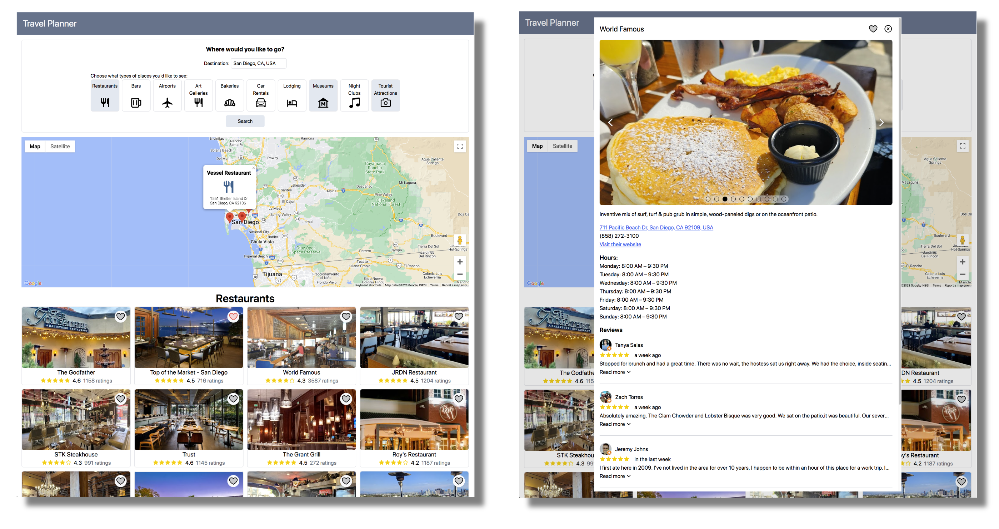

# Travel Planner

Try it out: <https://jackagtual.github.io/Travel-Planner-Frontend/>

This app allows you to search a travel destination for different types of attractions. The user can search for a place with an input field that provides autocomplete suggestions. After a destination is selected the user can select differnt types of attractions to display such as: restaurants, museums, tourrist attractions, etc.

The local weather forecast is also displayed.

The user can favorite certain results to be displayed on a map.

Click on a place to view more pictures, address and phone number, hours, and reviews.



## Technical Details

The frontend was crafted using React, TypeScript, and Tailwind CSS, employing a mobile-first design approach for full responsiveness. React was used to create an interactive user experience; attractions could be liked, and a click would open a modal with comprehensive information. A react google maps library was used to display user selected destinations on an interactive map.

The Express.js backend aggregated data from multiple external APIs to ensure up-to-date attraction details. Custom hooks were used to fetch data from a google maps api and weather api.

Check out the backend code here: https://github.com/JackAgtual/Travel-Planner-Backend

## Installation

After cloning the repo run the following npm commands:

```
npm i
npm run dev
```

## Future Work

- Allow user to create itinerary
- Store user session in a database or local storage
- Button to load more data of a specific type of attarction (eg. load more restaurants)
- Specific messages/warnings if backend rate limit is reached
